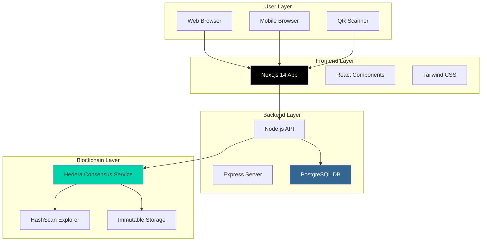
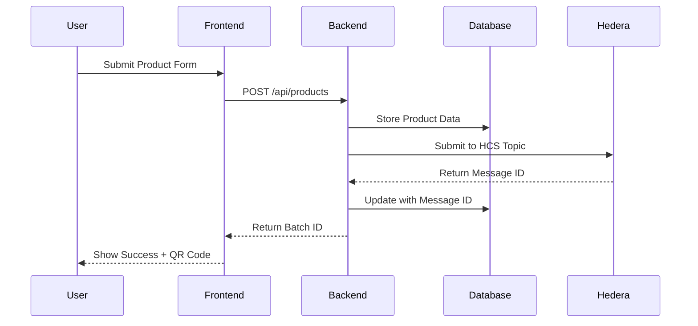
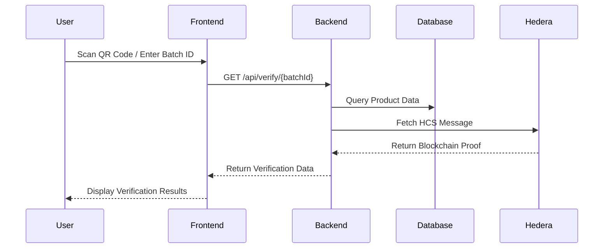

# System Architecture Overview 🏗️

Veritas is built as a modern, scalable web application with blockchain integration for immutable record keeping.

## High-Level Architecture

## Core Components

### 1. Frontend (Next.js)
- **Framework**: Next.js 14 with App Router
- **Language**: TypeScript for type safety
- **Styling**: Tailwind CSS for responsive design
- **Features**: 
  - Server-side rendering (SSR)
  - Static site generation (SSG)
  - QR code generation and scanning
  - Mobile-first responsive design

### 2. Backend (Node.js)
- **Runtime**: Node.js with Express framework
- **Database**: PostgreSQL for relational data
- **Features**:
  - RESTful API design
  - Data validation and sanitization
  - Blockchain integration
  - Error handling and logging

### 3. Blockchain (Hedera)
- **Network**: Hedera Consensus Service (HCS)
- **Purpose**: Immutable message storage
- **Benefits**:
  - 3-5 second finality
  - $0.0001 per transaction
  - Carbon negative consensus
  - Enterprise-grade security

## Data Flow

### Product Submission Flow

### Verification Flow

## Technology Stack

| Layer | Technology | Purpose | Why Chosen |
|-------|------------|---------|------------|
| **Frontend** | Next.js 14 | React framework | SSR, performance, developer experience |
| **Styling** | Tailwind CSS | Utility-first CSS | Rapid development, consistency |
| **Backend** | Node.js + Express | API server | JavaScript ecosystem, fast development |
| **Database** | PostgreSQL | Relational data | ACID compliance, complex queries |
| **Blockchain** | Hedera HCS | Immutable storage | Speed, cost, sustainability |
| **Deployment** | Vercel + Railway | Hosting | Global CDN, easy deployment |

## Security Architecture

### Data Protection
- **Input Validation**: All user inputs sanitized
- **SQL Injection**: Parameterized queries
- **XSS Protection**: Content Security Policy
- **HTTPS**: All communications encrypted

### Blockchain Security
- **Immutability**: Records cannot be altered
- **Transparency**: Public verification on HashScan
- **Consensus**: Hedera's aBFT consensus algorithm
- **Access Control**: Private keys secured

## Scalability Considerations

### Horizontal Scaling
- **Frontend**: CDN distribution via Vercel
- **Backend**: Stateless API servers
- **Database**: Read replicas for queries
- **Blockchain**: Hedera handles global scale

### Performance Optimization
- **Caching**: Redis for frequent queries
- **CDN**: Static assets globally distributed
- **Database**: Indexed queries and connection pooling
- **Blockchain**: Batch operations when possible

## Monitoring and Observability

### Metrics
- **Application**: Response times, error rates
- **Database**: Query performance, connection health
- **Blockchain**: Transaction success rates
- **User**: Page load times, conversion rates

### Logging
- **Structured Logging**: JSON format for parsing
- **Error Tracking**: Centralized error collection
- **Audit Trail**: All blockchain operations logged
- **Performance**: Request/response timing

---

**Next:** [Frontend Architecture](./frontend.md) for detailed frontend design.