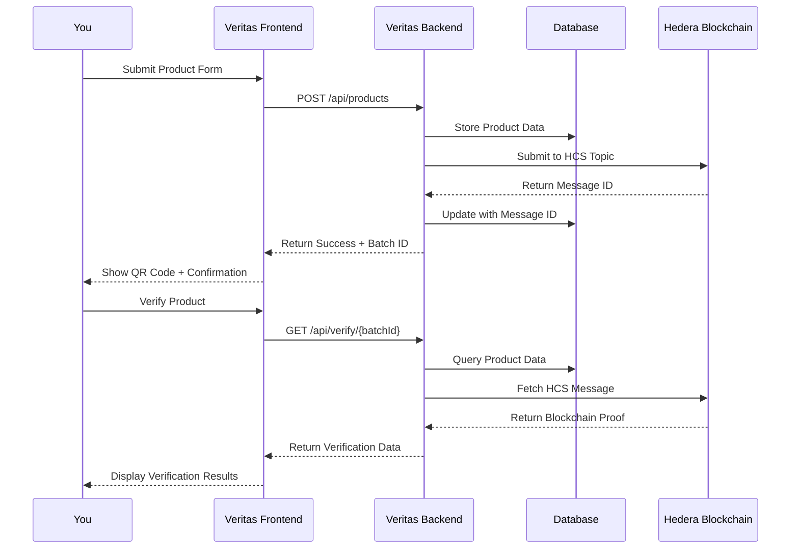

# First Steps 🚀

Your first journey with Veritas - from setup to your first verified product.

## Welcome to Veritas! 🎉

Congratulations on setting up Veritas! This guide will walk you through your first product submission and verification, helping you understand the complete workflow.

## Step 1: Verify Your Setup ✅

Before we start, let's make sure everything is working correctly.

### Check Backend Health
```bash
curl http://localhost:3002/health
```

Expected response:
```json
{
  "status": "healthy",
  "timestamp": "2024-01-01T00:00:00.000Z",
  "version": "1.0.0",
  "uptime": 123.45
}
```

### Check Frontend
Visit [http://localhost:3000](http://localhost:3000) - you should see the Veritas landing page.

### Check Hedera Connection
```bash
cd veritas-backend
node scripts/test-hedera.js
```

Expected output:
```
✅ Hedera connection successful
✅ Account balance: 100.00 HBAR
✅ Topic accessible: 0.0.1234567
```

## Step 2: Your First Product Submission 📝

Let's submit your first product to the blockchain!

### Navigate to Submit Page
Visit [http://localhost:3000/submit](http://localhost:3000/submit)

### Fill Out the Form

#### Basic Information
```
Product Name: Organic Colombian Coffee
Supplier Name: Mountain View Coffee Cooperative
Batch ID: COFFEE-2024-DEMO-001
```

#### Claims Section
Add these claims one by one:

**Claim 1: Organic Certification**
```
Type: Organic Certified
Description: USDA Organic Certified #2024-COL-089
Evidence: Certificate from USDA Organic Program
```

**Claim 2: Fair Trade**
```
Type: Fair Trade
Description: Fair Trade USA Certified #FT-2024-1001
Evidence: Fair Trade certification document
```

**Claim 3: Single Origin**
```
Type: Single Origin
Description: 100% Colombian beans from Huila region
Evidence: Import documentation and farm records
```

### Submit to Blockchain
1. Click **"Submit Product"**
2. Wait for blockchain confirmation (3-5 seconds)
3. Note the success message with batch ID

Expected result:
```
✅ Product submitted successfully!
Batch ID: COFFEE-2024-DEMO-001
Blockchain Message ID: 0.0.1234567-1234567890-123456789
QR Code generated and ready for download
```

## Step 3: Verify Your Product 🔍

Now let's verify the product we just submitted.

### Method 1: Direct Verification
1. Visit [http://localhost:3000/verify](http://localhost:3000/verify)
2. Enter batch ID: `COFFEE-2024-DEMO-001`
3. Click **"Verify Product"**

### Method 2: QR Code Verification
1. Download the QR code from the submission success page
2. Use any QR scanner app on your phone
3. Scan the QR code - it should redirect to the verification page

### Verification Results
You should see:

```
✅ VERIFIED PRODUCT

Product: Organic Colombian Coffee
Supplier: Mountain View Coffee Cooperative
Batch ID: COFFEE-2024-DEMO-001

Verified Claims:
✅ Organic Certified - USDA Organic Certified #2024-COL-089
✅ Fair Trade - Fair Trade USA Certified #FT-2024-1001  
✅ Single Origin - 100% Colombian beans from Huila region

Blockchain Proof:
📅 Submitted: 2024-01-01 12:00:00 UTC
🔗 Message ID: 0.0.1234567-1234567890-123456789
🌐 View on HashScan: [Link]
```

## Step 4: Explore Blockchain Proof 🔗

Let's verify the immutable blockchain record.

### View on HashScan
1. Click the **"View on HashScan"** link from verification results
2. You'll see the transaction on Hedera's public explorer
3. Note the timestamp and message content

### What You'll See on HashScan
- **Transaction ID**: Unique identifier
- **Timestamp**: Exact submission time
- **Message**: Your product data (encrypted)
- **Status**: SUCCESS (confirmed on blockchain)

## Step 5: Understanding the Workflow 🔄

Now that you've completed your first submission, let's understand what happened:

### Data Flow Diagram


### Key Components
1. **Frontend**: User interface for submission and verification
2. **Backend**: API server handling business logic
3. **Database**: Stores product metadata and relationships
4. **Hedera**: Immutable blockchain storage for claims
5. **HashScan**: Public blockchain explorer for transparency

## Step 6: Try Advanced Features 🎯

### Bulk Product Submission
```bash
# Create a CSV file with multiple products
cd veritas-backend
node scripts/bulk-import.js sample-products.csv
```

### API Integration
```javascript
// Submit product via API
const response = await fetch('http://localhost:3002/api/products', {
  method: 'POST',
  headers: {
    'Content-Type': 'application/json',
  },
  body: JSON.stringify({
    product_name: 'Organic Tea',
    supplier_name: 'Green Valley Tea Co.',
    claims: [
      {
        type: 'organic_certified',
        description: 'USDA Organic Certified',
        evidence: 'Certificate #2024-TEA-001'
      }
    ]
  })
});

const result = await response.json();
console.log('Batch ID:', result.data.batch_id);
```

### QR Code Integration
```html
<!-- Add QR code to your website -->

```

## Step 7: Explore Demo Products 🧪

We've included several demo products for you to explore:

### Coffee Products
- `COFFEE-2024-1001` - Ethiopian Single Origin
- `COFFEE-2024-1002` - Colombian Fair Trade
- `COFFEE-2024-1003` - Brazilian Organic

### Fashion Products
- `SHIRT-ECO-2024-456` - Organic Cotton T-Shirt
- `JEANS-FAIR-2024-789` - Fair Trade Denim

### Electronics
- `PHONE-REF-2024-321` - Refurbished Smartphone

Try verifying these products:
```bash
# Quick verification test
curl http://localhost:3002/api/verify/COFFEE-2024-1001
```

## Step 8: Customize Your Instance 🎨

### Branding
1. Replace `/public/logo.svg` with your logo
2. Update colors in `tailwind.config.js`
3. Modify app name in environment variables

### Custom Claims Types
Add your industry-specific claim types:

```javascript
// veritas-backend/config/claimTypes.js
const claimTypes = {
  // Food & Beverage
  'organic_certified': 'Organic Certified',
  'fair_trade': 'Fair Trade',
  'non_gmo': 'Non-GMO',
  'gluten_free': 'Gluten Free',
  
  // Fashion
  'gots_certified': 'GOTS Certified',
  'fair_labor': 'Fair Labor',
  'recycled_materials': 'Recycled Materials',
  
  // Electronics
  'conflict_free': 'Conflict-Free Minerals',
  'energy_star': 'Energy Star Certified',
  'recycled_content': 'Recycled Content',
  
  // Add your custom types here
  'custom_claim': 'Your Custom Claim Type'
};
```

## Step 9: Production Preparation 🚀

### Environment Setup
```bash
# Create production environment files
cp veritas-backend/.env.example veritas-backend/.env.production
cp veritas-frontend/.env.example veritas-frontend/.env.production

# Update with production values
# - Hedera mainnet credentials
# - Production database URL
# - Production domain names
```

### Security Checklist
- [ ] Change default passwords
- [ ] Enable HTTPS
- [ ] Configure rate limiting
- [ ] Set up monitoring
- [ ] Enable error tracking
- [ ] Configure backups

### Deployment Options
1. **Vercel + Railway** (Recommended)
   - Frontend: Deploy to Vercel
   - Backend: Deploy to Railway
   - Database: Railway PostgreSQL

2. **Docker Deployment**
   ```bash
   docker-compose -f docker-compose.prod.yml up -d
   ```

3. **Manual Deployment**
   - Any VPS with Node.js support
   - Nginx reverse proxy
   - PM2 process manager

## Step 10: Next Steps 📚

Congratulations! You've successfully:
- ✅ Set up Veritas locally
- ✅ Submitted your first product
- ✅ Verified blockchain records
- ✅ Understood the workflow
- ✅ Explored advanced features

### Continue Learning
- 📖 [API Documentation](../api/overview.md) - Integrate with your systems
- 🏗️ [Architecture Guide](../architecture/overview.md) - Understand the system
- 🏭 [Business Use Cases](../use-cases/business.md) - Real-world applications
- 🔧 [Development Guide](../development/setup.md) - Contribute to the project

### Get Support
- 💬 [GitHub Discussions](https://github.com/nikhlu07/veritas/discussions)
- 🐛 [Report Issues](https://github.com/nikhlu07/veritas/issues)
- 📧 [Email Support](mailto:support@veritas.app)
- 💬 [Discord Community](https://discord.gg/veritas)

### Share Your Success
- ⭐ [Star the repository](https://github.com/nikhlu07/veritas)
- 🐦 [Tweet about your experience](https://twitter.com/intent/tweet?text=Just%20set%20up%20@VeritasBlockchain%20for%20supply%20chain%20verification!)
- 📝 [Write a blog post](https://dev.to/new)
- 🎥 [Create a demo video](https://youtube.com)

---

**Welcome to the future of supply chain transparency!** 🌟

You're now part of a growing community building trust through blockchain technology. Every product you verify helps create a more transparent world.

**Next:** [Development Setup](../development/setup.md) if you want to contribute to Veritas.