# Veritas 🔗
**Blockchain-Powered Supply Chain Verification for a Transparent Future**

<div align="center">


[](https://hedera.com)
[](https://nextjs.org)
[](https://typescriptlang.org)
[](https://tailwindcss.com)

[🚀 Live Demo](https://veritas-tau.vercel.app/) • [📖 Documentation](./docs) • [🎥 Demo Video](https://youtube.com/demo) • [🧪 Try It Now](https://veritas-tau.vercel.app/demo)

</div>

---

## 🌍 The Problem We're Solving

> *"73% of consumers don't trust sustainability claims on products"*

In today's marketplace, when a company claims their product is:
- 🌱 "100% Organic" 
- ⚖️ "Fair Trade Certified"
- 🌿 "Carbon Neutral"
- 🤝 "Ethically Sourced"

**Consumers have NO way to verify these claims.** We're forced to simply trust marketing, creating a massive **trust gap** that enables greenwashing and false advertising.

## 💡 Our Solution

**Veritas transforms unverifiable marketing claims into immutable blockchain proof.**

```mermaid
graph LR
    A[🏭 Supplier] --> B[📝 Submit Claims]
    B --> C[⛓️ Hedera Blockchain]
    C --> D[🔍 Public Verification]
    D --> E[👥 Consumer Trust]
    
    style A fill:#e1f5fe
    style C fill:#00d4aa
    style E fill:#4caf50
```

<div align="center">



</div>

### How It Works

| Step | Action | Technology | Result |
|------|--------|------------|--------|
| 1️⃣ | **Submit Claims** | Web Interface | Supplier logs product details & sustainability claims |
| 2️⃣ | **Blockchain Storage** | Hedera HCS | Claims permanently recorded with timestamp |
| 3️⃣ | **QR Generation** | Dynamic QR Codes | Unique code links physical product to digital proof |
| 4️⃣ | **Public Verification** | Mobile Scanner | Anyone can verify claims instantly |

---

## ✨ Key Features

<table>
  <tr>
    <td align="center">
      
      <br><strong>Immutable Records</strong>
      <br>Hedera Consensus Service ensures claims can never be altered
    </td>
    <td align="center">
      
      <br><strong>QR Integration</strong>
      <br>Connect physical products to digital verification
    </td>
    <td align="center">
      
      <br><strong>Mobile Ready</strong>
      <br>Scan and verify from any mobile browser
    </td>
    <td align="center">
      
      <br><strong>Instant Verification</strong>
      <br>3-5 second blockchain confirmation
    </td>
  </tr>
</table>

### 🛠️ Technical Highlights

- **⚡ Lightning Fast**: 3-5 second finality via Hedera
- **💰 Cost Effective**: $0.0001 per verification vs $10+ on other blockchains  
- **🌿 Carbon Negative**: Hedera's sustainable consensus mechanism
- **📱 Universal Access**: Works in any web browser, no app required
- **🔗 Tamper Proof**: Immutable blockchain records with HashScan links
- **📊 Enterprise Ready**: Built for global supply chain scale

---

## 🏗️ Architecture


### Tech Stack

| Category | Technology | Purpose |
|----------|------------|---------|
| **Frontend** | Next.js 14, TypeScript, Tailwind CSS | Modern React framework with enterprise TypeScript |
| **Backend** | Node.js, Express, PostgreSQL | Scalable API with relational data management |
| **Blockchain** | Hedera Consensus Service (HCS) | Immutable message storage and timestamping |
| **QR Codes** | react-qr-code, html5-qrcode | Generation and scanning functionality |
| **Deployment** | Vercel (Frontend), Railway (Backend) | Global CDN and scalable hosting |

---

## 🚀 Quick Start

### Prerequisites

- Node.js 18+
- PostgreSQL (optional for demo)
- [Hedera Testnet Account](https://portal.hedera.com)

### 1️⃣ Clone & Install

```bash
git clone https://github.com/nikhlu07/veritas.git
cd veritas

# Install dependencies for both frontend and backend
npm run install:all
```

### 2️⃣ Environment Setup

```bash
# Backend configuration
cp veritas-backend/.env.example veritas-backend/.env

# Frontend configuration  
cp veritas-frontend/.env.example veritas-frontend/.env.local
```

**Configure your Hedera credentials:**
```env
HEDERA_ACCOUNT_ID=0.0.YOUR_ACCOUNT_ID
HEDERA_PRIVATE_KEY=your_private_key_here
HEDERA_NETWORK=testnet
```

### 3️⃣ Create Hedera Topic

```bash
cd veritas-backend
node create-new-topic.js
```

### 4️⃣ Start Development

```bash
# Start both frontend and backend
npm run dev

# Or start individually:
npm run dev:backend    # Backend on :3002
npm run dev:frontend   # Frontend on :3000
```

🎉 **Visit [http://localhost:3000](http://localhost:3000) to see Veritas in action!**

---

## 🎯 Usage Examples

### 🏭 For Businesses: Submit Product Claims

```javascript
// Example: Colombian Coffee Verification
{
  "product_name": "Colombian Single-Origin Coffee",
  "supplier_name": "Mountain View Coffee Cooperative",
  "batch_id": "COFFEE-2024-1001",
  "claims": [
    {
      "type": "organic_certified",
      "description": "USDA Organic Certified #2024-COL-089"
    },
    {
      "type": "fair_trade",
      "description": "Fair Trade USA Certified #FT-2024-1001"
    }
  ]
}
```

### 🔍 For Consumers: Instant Verification

1. **Scan QR Code** on product packaging
2. **View Claims** with blockchain timestamps  
3. **Verify on HashScan** - see immutable proof
4. **Trust with Confidence** - no more guessing

---

## 🌍 Real-World Impact

### Use Cases

<div align="center">

| Industry | Claims Verified | Impact |
|----------|----------------|--------|
| ☕ **Food & Beverage** | Organic, Fair Trade, Single Origin | Eliminate food fraud, support farmer premiums |
| 👕 **Fashion & Textiles** | GOTS Certified, Living Wage, Ethical Labor | Combat fast fashion, ensure worker rights |
| 📱 **Electronics** | Conflict-Free Minerals, Recycled Materials | Responsible sourcing, circular economy |
| 💊 **Pharmaceuticals** | Cold Chain, Authenticity, Expiration | Patient safety, counterfeit prevention |

</div>

### Market Opportunity

- **📈 $6.2B** - Global supply chain transparency market by 2025
- **🌱 73%** - Consumers willing to pay more for sustainable products  
- **📋 2030** - EU Digital Product Passport mandate
- **🔒 $52B** - Annual losses from counterfeit goods

---

## 🧪 API Reference

### Core Endpoints

```bash
# Submit new product with claims
POST /api/products
{
  "product_name": "Product Name",
  "supplier_name": "Supplier Name", 
  "claims": [...]
}

# Verify product by batch ID
GET /api/verify/{batchId}

# Get product details
GET /api/products/{batchId}

# Health check
GET /health
```

**📚 [Full API Documentation](./veritas-backend/API-TEST-RESULTS.md)**

---

## 🎬 Live Demo

<div align="center">

### Try Veritas Right Now!

| Demo Scenario | Batch ID | QR Link |
|---------------|----------|---------|
| ☕ **Colombian Coffee** | `COFFEE-2024-1001` | [Verify Now](https://veritas-app.vercel.app/verify/COFFEE-2024-1001) |
| 👕 **Organic T-Shirt** | `SHIRT-ECO-2024-456` | [Verify Now](https://veritas-app.vercel.app/verify/SHIRT-ECO-2024-456) |
| 📱 **Refurbished Phone** | `PHONE-REF-2024-789` | [Verify Now](https://veritas-app.vercel.app/verify/PHONE-REF-2024-789) |

**🎥 [Watch 3-Minute Demo Video](https://youtube.com/demo)**

</div>

---

## 🏆 Why Hedera?

<div align="center">

| Feature | Hedera | Ethereum | Bitcoin |
|---------|--------|----------|---------|
| **Transaction Speed** | 3-5 seconds | 15+ minutes | 60+ minutes |
| **Cost per Transaction** | $0.0001 | $10-50 | $5-20 |
| **Energy Consumption** | Carbon Negative | High | Very High |
| **Finality** | Immediate | Probabilistic | Probabilistic |
| **Enterprise Adoption** | ✅ High | ⚠️ Medium | ❌ Low |

</div>

**Hedera's combination of speed, cost-effectiveness, and sustainability makes it perfect for global supply chain verification.**

---

## 📊 Project Status

### ✅ Completed Features

- [x] **Core Blockchain Integration** - Hedera HCS message submission/retrieval
- [x] **Full-Stack Application** - Next.js frontend + Node.js backend  
- [x] **QR Code System** - Generation, scanning, and verification
- [x] **Responsive Design** - Mobile-first, professional UI
- [x] **API Documentation** - Complete endpoint documentation
- [x] **Demo Data** - Real products with blockchain verification
- [x] **Deployment Ready** - Production configuration and hosting

### 🚧 Roadmap

**Phase 1 (Q2 2024)**
- [ ] Multi-tenant business accounts
- [ ] Advanced analytics dashboard
- [ ] Mobile app (iOS/Android)
- [ ] API rate limiting and authentication

**Phase 2 (Q3 2024)**  
- [ ] IoT sensor integration for automated claims
- [ ] Multi-language support (Spanish, French, German)
- [ ] Enterprise API partnerships
- [ ] Advanced fraud detection

**Phase 3 (Q4 2024)**
- [ ] AI-powered claim verification
- [ ] Integration with major e-commerce platforms
- [ ] Global regulatory compliance (EU DPP)
- [ ] Sustainability impact tracking

---

## 🤝 Contributing

We welcome contributions! Here's how to get started:

### Development Setup

```bash
# Fork the repository
git clone https://github.com/YOUR_USERNAME/veritas.git

# Create feature branch
git checkout -b feature/amazing-feature

# Make your changes and test
npm run test

# Commit with conventional commits
git commit -m "feat: add amazing feature"

# Push and create PR
git push origin feature/amazing-feature
```

### Contribution Guidelines

- 📝 Follow our [Code of Conduct](./CODE_OF_CONDUCT.md)
- 🧪 Add tests for new features
- 📚 Update documentation
- 🎨 Follow existing code style
- ✅ Ensure all tests pass

**🙏 [See Contributing Guide](./CONTRIBUTING.md) for detailed instructions**

---

## 📞 Community & Support

<div align="center">

[](https://github.com/nikhlu07/veritas/issues)
[](https://github.com/nikhlu07/veritas/discussions)
[](https://discord.gg/veritas)
[](https://twitter.com/veritasblockchain)

**💬 Join our community for support, updates, and discussions!**

</div>

### Getting Help

- 🐛 **Bug Reports**: [Create an Issue](https://github.com/nikhlu07/veritas/issues/new?template=bug_report.md)
- 💡 **Feature Requests**: [Request a Feature](https://github.com/nikhlu07/veritas/issues/new?template=feature_request.md)  
- 💬 **Questions**: [GitHub Discussions](https://github.com/nikhlu07/veritas/discussions)
- 📧 **Email**: support@veritas.app

---

## 📄 License

This project is licensed under the **MIT License** - see the [LICENSE](LICENSE) file for details.

### Open Source Notice

Veritas is proudly open source. We believe transparency in supply chains starts with transparency in our own code. Feel free to:

- ✅ Use for commercial projects
- ✅ Modify and distribute  
- ✅ Create derivatives
- ✅ Private use

Just keep the license notice and we're good! 🎉

---

## 🙏 Acknowledgments

<div align="center">

**Special thanks to the amazing open source community:**

[](https://hedera.com)
[](https://nextjs.org)
[](https://tailwindcss.com)
[](https://vercel.com)

</div>

- 🏗️ **[Hedera Hashgraph](https://hedera.com)** - For the most sustainable, enterprise-grade blockchain
- ⚛️ **[Next.js Team](https://nextjs.org)** - For the incredible React framework
- 🎨 **[Tailwind CSS](https://tailwindcss.com)** - For making CSS enjoyable again
- 🚀 **[Vercel](https://vercel.com)** - For seamless deployment and hosting
- 🌟 **[All Contributors](./CONTRIBUTORS.md)** - For making Veritas better every day

---

<div align="center">

## 🌟 Star History

[](https://star-history.com/#nikhlu07/veritas&Date)

---

**Built with ❤️ for a more transparent world**

*Veritas: Where trust meets technology*

[](https://github.com/nikhlu07/veritas)
[](https://www.buymeacoffee.com/veritas)

</div>
